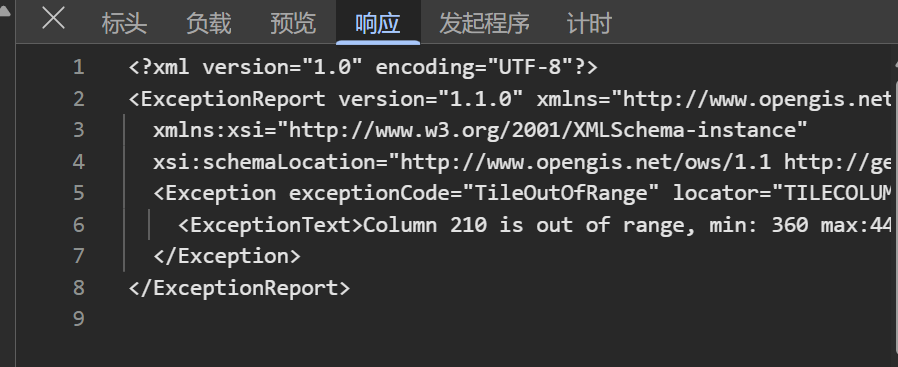
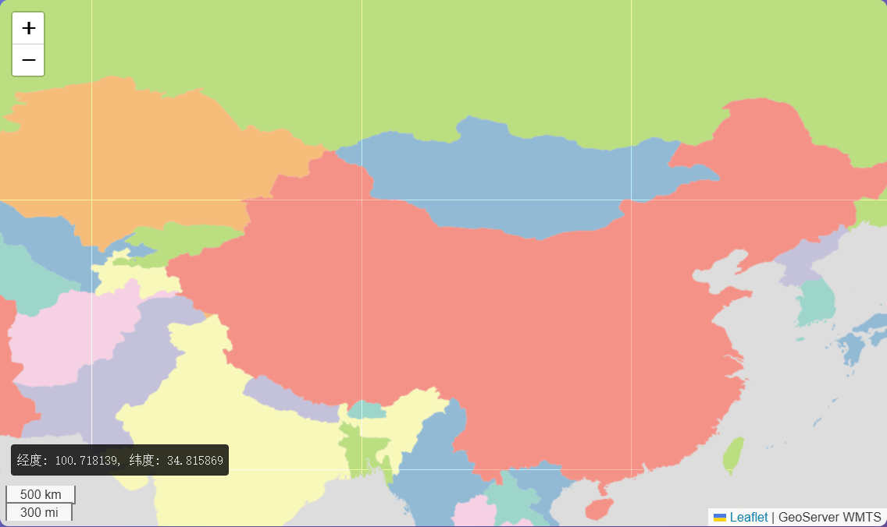
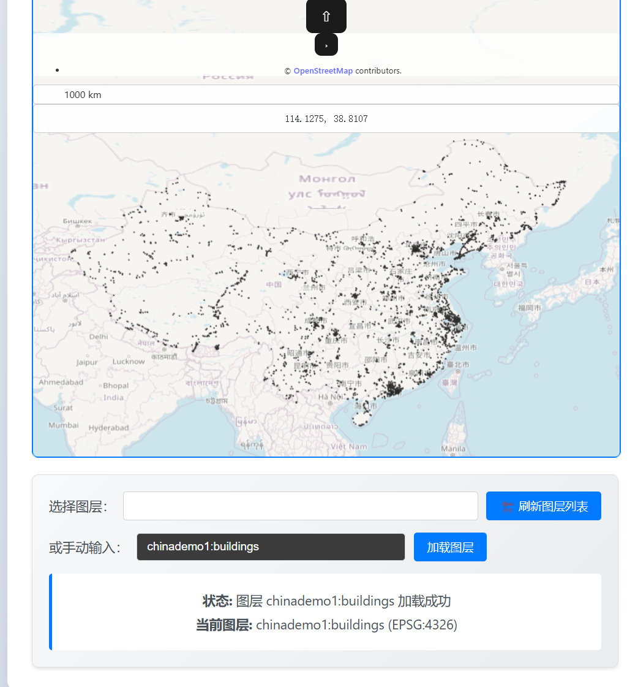

tms、wms、wmts、坐标系（3857、4490、4326）、leaflet、openlayer

# **一、[WebGIS](https://zhida.zhihu.com/search?content_id=223660928&content_type=Article&match_order=1&q=WebGIS&zhida_source=entity)**

Web就是网页端，GIS全称是[地理信息系统](https://zhida.zhihu.com/search?content_id=223660928&content_type=Article&match_order=1&q=地理信息系统&zhida_source=entity)；所以WebGIS系统就是网页端的地理信息系统，简单点说将地理空间信息以地图的方式在网页端展现出来，做可视化或者是[空间分析](https://zhida.zhihu.com/search?content_id=223660928&content_type=Article&match_order=1&q=空间分析&zhida_source=entity)功能。

# 二、WMS(网络地图服务)、WMTS(网络地图瓦片服务)、TMS(瓦片地图服务)

Web地图服务规范包括WMS(网络地图服务)、WMTS(网络地图瓦片服务)、TMS(瓦片地图服务)等。WMTS服务和WMS服务都是由开发地理信息联盟(OGC)指定。其不同在于，WMTS服务采用缓存技术能够缓解WebGis服务器端数据处理的压力。TMS服务由开源空间信息基金会(OSGEO)指定。TMS与WMTS服务的差异主要体现在:

TMS是纯Restful，而WMTS可以有KVP、SOAP和Restful三种。
TMS瓦片是正方形的，而WMTS是矩形的（正方形是特殊的矩形）
在纵轴方向上方向相反，TMS瓦片以左下角为原点，WMTS瓦片以左上角为原点。
WMTS中对应的不同比例尺瓦片可以尺寸不同。
在地图服务中，为了处理方便，瓦片均采用正方形，一般像素为256（居多）或者512。

**这周可以做下这两个任务:**
**1.geoserver发布tms  wmts瓦片服务**
**2.通过openlayer或leaflet实现瓦片服务的加载显示，提供比例尺，经纬度等小组件的显示，可以基于vue编写**

进度：

**学习安装部署geoserver和上传、配置、发布、地图图层**

http://localhost:8080/geoserver

默认账户名admin，密码geoserver

[几个shape格式、tiff格式地图免费下载网站_地图tif 下载-CSDN博客](https://blog.csdn.net/sunnyloves/article/details/45618089)

## 前端：

```bash
npm create vite@latest wmts-demo -- --template vue
cd wmts-demo
npm install
```

报错如下：

```bash
error when starting dev server: TypeError: crypto.hash is not a function    at getHash (file:///F:/Desktop/geo/geodemo/front-end/wmts-demo/node_modules/vite/dist/node/chunks/dep-DZ2tZksn.js:2788:21)    at getLockfileHash (file:///F:/Desktop/geo/geodemo/front-end/wmts-demo/node_modules/vite/dist/node/chunks/dep-DZ2tZksn.js:11673:9)    at getDepHash (file:///F:/Desktop/geo/geodemo/front-end/wmts-demo/node_modules/vite/dist/node/chunks/dep-DZ2tZksn.js:11676:23)    at initDepsOptimizerMetadata (file:///F:/Desktop/geo/geodemo/front-end/wmts-demo/node_modules/vite/dist/node/chunks/dep-DZ2tZksn.js:11137:53)    at createDepsOptimizer (file:///F:/Desktop/geo/geodemo/front-end/wmts-demo/node_modules/vite/dist/node/chunks/dep-DZ2tZksn.js:34586:17)    at new DevEnvironment (file:///F:/Desktop/geo/geodemo/front-end/wmts-demo/node_modules/vite/dist/node/chunks/dep-DZ2tZksn.js:35350:109)    at Object.defaultCreateClientDevEnvironment [as createEnvironment] (file:///F:/Desktop/geo/geodemo/front-end/wmts-demo/node_modules/vite/dist/node/chunks/dep-DZ2tZksn.js:35769:9)    at _createServer (file:///F:/Desktop/geo/geodemo/front-end/wmts-demo/node_modules/vite/dist/node/chunks/dep-DZ2tZksn.js:28344:132)    at async CAC.<anonymous> (file:///F:/Desktop/geo/geodemo/front-end/wmts-demo/node_modules/vite/dist/node/cli.js:573:18) PS F:\Desktop\geo\geodemo\front-end\wmts-demo> 
```

疑似node版本的问题，高版本vite与低版本node之间有问题（node.js版本为v21.5)

报了一大堆错，**发现和切片的范围有关：**


### leaflet:

```vue
<template>
  <div class="leaflet-wmts-container">
    <h3>📍 Leaflet WMTS 地图服务</h3>
    
    <div class="leaflet-controls">
      <button @click="initializeMap" :disabled="mapInitialized" class="btn-primary">
        {{ mapInitialized ? '✅ 地图已初始化' : '🗺️ 初始化地图' }}
      </button>
      <button @click="testWMTSConnection" class="btn-info">
        🔧 测试 WMTS 连接
      </button>
      <button @click="loadWMTSLayer" :disabled="!mapInitialized" class="btn-success">
       b 🏢 加载 WMTS 图层
      </button>
      <button @click="loadOSMLayer" :disabled="!mapInitialized" class="btn-info">
        🌍 加载 OSM 底图
      </button>
      <button @click="clearLayers" :disabled="!mapInitialized" class="btn-warning">
        🗑️ 清除图层
      </button>
    </div>
    
    <div class="layer-controls">
      <div class="control-group">
        <label>WMTS 图层名称:</label>
        <select v-model="wmtsLayerName">
          <option value="ne:countries">ne:countries (国家边界)</option>
          <option value="nurc:mosaic">nurc:mosaic (栅格数据)</option>
          <option value="chinademo1:buildings">chinademo1:buildings (中国建筑)</option>
          <option value="topp:states">topp:states (美国州界)</option>
        </select>
        <input v-model="wmtsLayerName" placeholder="或手动输入图层名称" style="margin-top: 5px;" />
      </div>
      
      <div class="control-group">
        <label>瓦片格式:</label>
        <select v-model="tileFormat">
          <option value="image/png">PNG</option>
          <option value="image/jpeg">JPEG</option>
          <option value="image/webp">WebP</option>
        </select>
      </div>
      
      <div class="control-group">
        <label>坐标系:</label>
        <select v-model="crs" @change="onCRSChange">
          <option value="EPSG:4326">EPSG:4326 (WGS84)</option>
          <option value="EPSG:3857">EPSG:3857 (Web Mercator)</option>
        </select>
      </div>
      
      <div class="control-group">
        <label>图层透明度:</label>
        <input type="range" v-model="layerOpacity" min="0" max="1" step="0.1" />
        <span>{{ layerOpacity }}</span>
      </div>
    </div>
    
    <!-- 地图容器 -->
    <div ref="mapContainer" class="leaflet-map"></div>
    
    <!-- 快速定位按钮 -->
    <div class="quick-locations" v-if="mapInitialized">
      <h5>🎯 快速定位</h5>
      <div class="location-buttons">
        <button @click="flyToLocation(116.4, 39.9, 10)" class="location-btn">
          🏛️ 北京
        </button>
        <button @click="flyToLocation(121.5, 31.2, 10)" class="location-btn">
          🏙️ 上海
        </button>
        <button @click="flyToLocation(113.3, 23.1, 10)" class="location-btn">
          🌺 广州
        </button>
        <button @click="flyToLocation(104.1, 30.7, 10)" class="location-btn">
          🐼 成都
        </button>
      </div>
    </div>
    
    <!-- 状态信息 -->
    <div class="status-panel">
      <h5>📊 状态信息</h5>
      <div class="status-grid">
        <div class="status-item">
          <span class="label">地图状态:</span>
          <span class="value" :class="mapInitialized ? 'success' : 'pending'">
            {{ mapInitialized ? '已初始化' : '未初始化' }}
          </span>
        </div>
        <div class="status-item">
          <span class="label">当前中心:</span>
          <span class="value">{{ currentCenter }}</span>
        </div>
        <div class="status-item">
          <span class="label">缩放级别:</span>
          <span class="value">{{ currentZoom }}</span>
        </div>
        <div class="status-item">
          <span class="label">加载的图层:</span>
          <span class="value">{{ loadedLayers.join(', ') || '无' }}</span>
        </div>
      </div>
    </div>
    
    <!-- 错误信息 -->
    <div v-if="errorMessage" class="error-panel">
      <h5>⚠️ 错误信息</h5>
      <pre>{{ errorMessage }}</pre>
      <button @click="clearError" class="btn-danger">清除错误</button>
    </div>
  </div>
</template>

<script setup>
import { ref, onMounted, onUnmounted, watch } from 'vue'
import L from 'leaflet'
import 'leaflet/dist/leaflet.css'

// 响应式数据
const mapContainer = ref(null)
const mapInitialized = ref(false)
const wmtsLayerName = ref('ne:countries') // 使用确实存在的图层
const tileFormat = ref('image/png')
const crs = ref('EPSG:4326')
const layerOpacity = ref(0.8)
const currentCenter = ref('')
const currentZoom = ref(0)
const loadedLayers = ref([])
const errorMessage = ref('')

// 地图和图层实例
let map = null
let wmtsLayer = null
let osmLayer = null

// 初始化地图
const initializeMap = () => {
  try {
    if (map) {
      map.remove()
    }
    
    // 根据选择的坐标系创建地图
    const mapOptions = {
      center: crs.value === 'EPSG:4326' ? [35, 105] : [39.9, 116.4],
      zoom: 6,
      zoomControl: true,
      attributionControl: true
    }
    
    // 如果是 EPSG:4326，使用特殊的 CRS
    if (crs.value === 'EPSG:4326') {
      mapOptions.crs = L.CRS.EPSG4326
    }
    
    map = L.map(mapContainer.value, mapOptions)
    
    // 监听地图事件
    map.on('moveend', updateMapInfo)
    map.on('zoomend', updateMapInfo)
    
    // 添加比例尺
    L.control.scale().addTo(map)
    
    // 添加坐标显示
    const coordsControl = L.control({ position: 'bottomleft' })
    coordsControl.onAdd = function() {
      const div = L.DomUtil.create('div', 'coords-control')
      div.style.background = 'rgba(255,255,255,0.8)'
      div.style.padding = '5px'
      div.style.borderRadius = '3px'
      div.innerHTML = '移动鼠标查看坐标'
      return div
    }
    coordsControl.addTo(map)
    
    // 鼠标移动显示坐标
    map.on('mousemove', (e) => {
      const coords = map.getContainer().querySelector('.coords-control')
      if (coords) {
        coords.innerHTML = `经度: ${e.latlng.lng.toFixed(6)}, 纬度: ${e.latlng.lat.toFixed(6)}`
      }
    })
    
    mapInitialized.value = true
    updateMapInfo()
    clearError()
    
    console.log('Leaflet 地图初始化成功')
    
  } catch (error) {
    errorMessage.value = `地图初始化失败: ${error.message}`
    console.error('地图初始化错误:', error)
  }
}

// 加载 WMTS 图层
const loadWMTSLayer = () => {
  try {
    if (!map) return
    
    // 移除现有的 WMTS 图层
    if (wmtsLayer) {
      map.removeLayer(wmtsLayer)
    }
    
    // 构建 WMTS URL 模板
    const wmtsUrl = buildWMTSUrl()
    
    console.log('WMTS URL:', wmtsUrl)
    
    // 创建 WMTS 图层
    wmtsLayer = L.tileLayer(wmtsUrl, {
      attribution: 'GeoServer WMTS',
      opacity: parseFloat(layerOpacity.value),
      maxZoom: 18,
      tileSize: 256,
      // 错误处理
      errorTileUrl: 'data:image/svg+xml;base64,PHN2ZyB3aWR0aD0iMjU2IiBoZWlnaHQ9IjI1NiIgeG1sbnM9Imh0dHA6Ly93d3cudzMub3JnLzIwMDAvc3ZnIj48cmVjdCB3aWR0aD0iMTAwJSIgaGVpZ2h0PSIxMDAlIiBmaWxsPSIjZmZmIi8+PHRleHQgeD0iNTAlIiB5PSI1MCUiIGZvbnQtZmFtaWx5PSJBcmlhbCIgZm9udC1zaXplPSIxNCIgZmlsbD0iI2NjYyIgdGV4dC1hbmNob3I9Im1pZGRsZSIgZHk9Ii4zZW0iPuaXoOazleWKoOi9vTwvdGV4dD48L3N2Zz4='
    })
    
    // 监听图层事件
    wmtsLayer.on('loading', () => {
      console.log('WMTS 图层开始加载')
    })
    
    wmtsLayer.on('load', () => {
      console.log('WMTS 图层加载完成')
      if (!loadedLayers.value.includes('WMTS')) {
        loadedLayers.value.push('WMTS')
      }
    })
    
    wmtsLayer.on('tileerror', (e) => {
      console.error('瓦片加载错误:', e)
      console.error('错误的瓦片坐标:', e.coords)
      console.error('瓦片URL:', e.tile.src)
      
      // 详细错误信息
      let errorDetail = '未知错误'
      if (e.error && e.error.target) {
        errorDetail = `HTTP 错误: ${e.error.target.status || 'Network Error'}`
      }
      
      errorMessage.value = `瓦片加载错误 [${e.coords.z}/${e.coords.x}/${e.coords.y}]: ${errorDetail}\nURL: ${e.tile.src}`
    })
    
    // 添加到地图
    wmtsLayer.addTo(map)
    
    clearError()
    
  } catch (error) {
    errorMessage.value = `WMTS 图层加载失败: ${error.message}`
    console.error('WMTS 图层加载错误:', error)
  }
}

// 构建 WMTS URL 模板 - 修复版本
const buildWMTSUrl = () => {
  const baseUrl = 'http://localhost:8080/geoserver/gwc/service/wmts'
  
  // 构建 URL 模板，注意 {z}, {x}, {y} 不要被 encodeURIComponent 编码
  const url = `${baseUrl}?` +
    `SERVICE=WMTS&` +
    `REQUEST=GetTile&` +
    `VERSION=1.0.0&` +
    `LAYER=${encodeURIComponent(wmtsLayerName.value)}&` +
    `STYLE=&` +
    `TILEMATRIXSET=${encodeURIComponent(crs.value)}&` +
    `FORMAT=${encodeURIComponent(tileFormat.value)}&` +
    `TILEMATRIX=${encodeURIComponent(crs.value)}:{z}&` +
    `TILEROW={y}&` +
    `TILECOL={x}`
  
  console.log('构建的 WMTS URL 模板:', url)
  return url
}

// 加载 OSM 图层
const loadOSMLayer = () => {
  try {
    if (!map) return
    
    // 移除现有的 OSM 图层
    if (osmLayer) {
      map.removeLayer(osmLayer)
    }
    
    // 创建 OSM 图层
    osmLayer = L.tileLayer('https://{s}.tile.openstreetmap.org/{z}/{x}/{y}.png', {
      attribution: '© OpenStreetMap contributors',
      opacity: 0.7,
      maxZoom: 19
    })
    
    osmLayer.addTo(map)
    
    if (!loadedLayers.value.includes('OSM')) {
      loadedLayers.value.push('OSM')
    }
    
    clearError()
    
  } catch (error) {
    errorMessage.value = `OSM 图层加载失败: ${error.message}`
    console.error('OSM 图层加载错误:', error)
  }
}

// 清除所有图层
const clearLayers = () => {
  if (wmtsLayer) {
    map.removeLayer(wmtsLayer)
    wmtsLayer = null
  }
  
  if (osmLayer) {
    map.removeLayer(osmLayer)
    osmLayer = null
  }
  
  loadedLayers.value = []
}

// 飞行到指定位置
const flyToLocation = (lng, lat, zoom = 10) => {
  if (map) {
    map.flyTo([lat, lng], zoom, {
      duration: 1.5
    })
  }
}

// 更新地图信息
const updateMapInfo = () => {
  if (map) {
    const center = map.getCenter()
    currentCenter.value = `${center.lng.toFixed(4)}, ${center.lat.toFixed(4)}`
    currentZoom.value = map.getZoom()
  }
}

// 坐标系变化处理
const onCRSChange = () => {
  if (mapInitialized.value) {
    // 重新初始化地图以应用新的坐标系
    initializeMap()
  }
}

// 清除错误
const clearError = () => {
  errorMessage.value = ''
}

// 监听图层透明度变化
watch(layerOpacity, (newOpacity) => {
  if (wmtsLayer) {
    wmtsLayer.setOpacity(parseFloat(newOpacity))
  }
})

// 测试 WMTS 连接
const testWMTSConnection = async () => {
  try {
    clearError()
    console.log('测试 WMTS 连接...')
    
    // 1. 测试 GetCapabilities
    const capabilitiesUrl = 'http://localhost:8080/geoserver/gwc/service/wmts?REQUEST=GetCapabilities'
    console.log('测试 GetCapabilities:', capabilitiesUrl)
    
    const response = await fetch(capabilitiesUrl)
    if (!response.ok) {
      throw new Error(`GetCapabilities 失败: ${response.status} ${response.statusText}`)
    }
    
    const xmlText = await response.text()
    console.log('GetCapabilities 成功获取')
    
    // 2. 测试具体的瓦片URL
    const testTileUrl = buildWMTSUrl()
      .replace('{z}', '1')
      .replace('{x}', '1') 
      .replace('{y}', '0')
    
    console.log('测试瓦片URL:', testTileUrl)
    
    const tileResponse = await fetch(testTileUrl)
    if (tileResponse.ok) {
      console.log('✅ 瓦片测试成功!')
      errorMessage.value = '✅ WMTS 连接测试成功！可以正常加载瓦片。'
    } else {
      console.log('❌ 瓦片测试失败:', tileResponse.status)
      errorMessage.value = `❌ 瓦片测试失败: ${tileResponse.status} ${tileResponse.statusText}\n可能原因: 图层不存在或瓦片超出范围`
    }
    
  } catch (error) {
    console.error('WMTS 连接测试失败:', error)
    errorMessage.value = `❌ WMTS 连接测试失败: ${error.message}`
  }
}

// 组件挂载时自动初始化地图
onMounted(() => {
  console.log('Leaflet WMTS 组件已挂载')
  // 延迟一点时间确保 DOM 渲染完成
  setTimeout(initializeMap, 100)
})

// 组件卸载时清理地图
onUnmounted(() => {
  if (map) {
    map.remove()
  }
})
</script>

<style scoped>
.leaflet-wmts-container {
  padding: 20px;
  background: linear-gradient(135deg, #667eea 0%, #764ba2 100%);
  border-radius: 10px;
  margin: 20px 0;
}

.leaflet-wmts-container h3 {
  color: white;
  margin: 0 0 20px 0;
  text-shadow: 1px 1px 2px rgba(0,0,0,0.3);
}

.leaflet-controls {
  display: flex;
  gap: 10px;
  margin-bottom: 15px;
  flex-wrap: wrap;
}

.leaflet-controls button {
  padding: 8px 16px;
  border: none;
  border-radius: 5px;
  cursor: pointer;
  font-weight: 500;
  transition: all 0.3s;
}

.btn-primary { background: #007bff; color: white; }
.btn-success { background: #28a745; color: white; }
.btn-info { background: #17a2b8; color: white; }
.btn-warning { background: #ffc107; color: #212529; }
.btn-danger { background: #dc3545; color: white; }

.leaflet-controls button:hover:not(:disabled) {
  transform: translateY(-2px);
  box-shadow: 0 4px 8px rgba(0,0,0,0.2);
}

.leaflet-controls button:disabled {
  opacity: 0.6;
  cursor: not-allowed;
}

.layer-controls {
  display: grid;
  grid-template-columns: repeat(auto-fit, minmax(200px, 1fr));
  gap: 15px;
  margin-bottom: 20px;
  padding: 15px;
  background: rgba(255,255,255,0.1);
  border-radius: 8px;
  backdrop-filter: blur(10px);
}

.control-group {
  display: flex;
  flex-direction: column;
  gap: 5px;
}

.control-group label {
  color: white;
  font-weight: 500;
  font-size: 14px;
}

.control-group input,
.control-group select {
  padding: 8px;
  border: 1px solid #ddd;
  border-radius: 4px;
  background: white;
}

.control-group input[type="range"] {
  background: transparent;
}

.leaflet-map {
  width: 100%;
  height: 500px;
  border-radius: 8px;
  box-shadow: 0 8px 25px rgba(0,0,0,0.3);
  margin-bottom: 20px;
}

.quick-locations {
  background: rgba(255,255,255,0.1);
  padding: 15px;
  border-radius: 8px;
  margin-bottom: 15px;
  backdrop-filter: blur(10px);
}

.quick-locations h5 {
  color: white;
  margin: 0 0 10px 0;
}

.location-buttons {
  display: flex;
  gap: 8px;
  flex-wrap: wrap;
}

.location-btn {
  padding: 6px 12px;
  background: rgba(255,255,255,0.2);
  color: white;
  border: 1px solid rgba(255,255,255,0.3);
  border-radius: 4px;
  cursor: pointer;
  transition: all 0.3s;
  font-size: 12px;
}

.location-btn:hover {
  background: rgba(255,255,255,0.3);
  transform: scale(1.05);
}

.status-panel {
  background: rgba(255,255,255,0.1);
  padding: 15px;
  border-radius: 8px;
  margin-bottom: 15px;
  backdrop-filter: blur(10px);
}

.status-panel h5 {
  color: white;
  margin: 0 0 10px 0;
}

.status-grid {
  display: grid;
  grid-template-columns: repeat(auto-fit, minmax(200px, 1fr));
  gap: 10px;
}

.status-item {
  display: flex;
  justify-content: space-between;
  padding: 8px 12px;
  background: rgba(255,255,255,0.1);
  border-radius: 4px;
}

.status-item .label {
  color: rgba(255,255,255,0.8);
  font-size: 12px;
}

.status-item .value {
  color: white;
  font-weight: 500;
  font-size: 12px;
}

.value.success { color: #90EE90; }
.value.pending { color: #FFD700; }

.error-panel {
  background: rgba(220, 53, 69, 0.1);
  border: 1px solid rgba(220, 53, 69, 0.3);
  padding: 15px;
  border-radius: 8px;
  backdrop-filter: blur(10px);
}

.error-panel h5 {
  color: #ff6b6b;
  margin: 0 0 10px 0;
}

.error-panel pre {
  background: rgba(0,0,0,0.2);
  color: #ffcccb;
  padding: 10px;
  border-radius: 4px;
  overflow-x: auto;
  font-size: 12px;
  margin: 10px 0;
}

/* 全局 Leaflet 样式覆盖 */
:deep(.leaflet-control-attribution) {
  background: rgba(255,255,255,0.8);
  backdrop-filter: blur(5px);
}

:deep(.leaflet-control-scale-line) {
  background: rgba(255,255,255,0.8);
  backdrop-filter: blur(5px);
}

:deep(.coords-control) {
  font-family: monospace;
  font-size: 12px;
  border: 1px solid rgba(0,0,0,0.2);
}
</style>

```



### openlayer:

```vue
<template>
  <div>
    <h2>GeoServer WMTS 测试</h2>
    <div ref="mapRef" class="map-container"></div>

    <div class="controls">
      <div class="control-group">
        <label>选择图层：</label>
        <select v-model="layerName" @change="onLayerChange">
          <option value="">-- 请选择图层 --</option>
          <option v-for="layer in availableLayers" :key="layer.name" :value="layer.name">
            {{ layer.name }} - {{ layer.title }}
          </option>
        </select>
        <button @click="getCapabilities">🔄 刷新图层列表</button>
      </div>
      
      <div class="control-group">
        <label>或手动输入：</label>
        <input v-model="layerName" placeholder="输入图层名，如 ne:countries" />
        <button @click="loadLayer">加载图层</button>
      </div>
      
      <div class="status-info">
        <p><strong>状态:</strong> {{ status }}</p>
        <p v-if="layerInfo"><strong>当前图层:</strong> {{ layerInfo }}</p>
      </div>
    </div>
  </div>
</template>

<script setup>
import { ref, onMounted } from 'vue'
import Map from 'ol/Map'
import View from 'ol/View'
import TileLayer from 'ol/layer/Tile'
import WMTS from 'ol/source/WMTS'
import OSM from 'ol/source/OSM'
import { get as getProjection } from 'ol/proj'
import WMTSCapabilities from 'ol/format/WMTSCapabilities'
import { optionsFromCapabilities } from 'ol/source/WMTS'
import { ScaleLine, MousePosition, defaults as defaultControls } from 'ol/control'
import { createStringXY } from 'ol/coordinate'

const mapRef = ref(null)
const layerName = ref('') 
const status = ref('初始化中...')
const availableLayers = ref([])
const layerInfo = ref('')
let map = null
let wmtsLayer = null
let osmLayer = null

// 获取可用图层列表
const getCapabilities = async () => {
  status.value = '获取图层列表中...'
  try {
    const response = await fetch('http://localhost:8080/geoserver/gwc/service/wmts?REQUEST=GetCapabilities')
    if (!response.ok) {
      throw new Error(`HTTP ${response.status}: ${response.statusText}`)
    }
    
    const text = await response.text()
    const parser = new WMTSCapabilities()
    const capabilities = parser.read(text)
    
    // 解析图层信息
    const layers = []
    if (capabilities.Contents && capabilities.Contents.Layer) {
      capabilities.Contents.Layer.forEach(layer => {
        layers.push({
          name: layer.Identifier,
          title: layer.Title || layer.Identifier,
          formats: layer.Format || [],
          tileMatrixSets: layer.TileMatrixSetLink ? 
            layer.TileMatrixSetLink.map(link => link.TileMatrixSet) : []
        })
      })
    }
    
    availableLayers.value = layers
    status.value = `发现 ${layers.length} 个可用图层`
    
    // 如果没有选中图层且有可用图层，选择第一个
    if (!layerName.value && layers.length > 0) {
      layerName.value = layers[0].name
    }
    
  } catch (error) {
    status.value = `获取图层列表失败: ${error.message}`
    console.error('获取 capabilities 错误:', error)
  }
}

// 图层选择变化处理
const onLayerChange = () => {
  if (layerName.value) {
    loadLayer()
  }
}

const loadLayer = async () => {
  if (!layerName.value) {
    status.value = '请输入图层名'
    return
  }

  status.value = `加载图层 ${layerName.value} 中...`

  try {
    const response = await fetch('http://localhost:8080/geoserver/gwc/service/wmts?REQUEST=GetCapabilities')
    const text = await response.text()

    const parser = new WMTSCapabilities()
    const capabilities = parser.read(text)

    const options = optionsFromCapabilities(capabilities, {
      layer: layerName.value,
      matrixSet: 'EPSG:4326', // 优先使用 EPSG:4326
    })

    if (!options) {
      // 如果 EPSG:4326 不可用，尝试 EPSG:3857
      const options3857 = optionsFromCapabilities(capabilities, {
        layer: layerName.value,
        matrixSet: 'EPSG:3857',
      })
      
      if (!options3857) {
        throw new Error('图层不支持 EPSG:4326 或 EPSG:3857 坐标系')
      }
      
      const source = new WMTS({
        ...options3857,
        crossOrigin: 'anonymous',
      })

      wmtsLayer.setSource(source)
      
      // 切换到 EPSG:3857 投影
      map.setView(new View({
        projection: 'EPSG:3857',
        center: [11700000, 4200000], // 中国中心 (Web Mercator)
        zoom: 5,
      }))
      
      layerInfo.value = `${layerName.value} (EPSG:3857)`
      
    } else {
      const source = new WMTS({
        ...options,
        crossOrigin: 'anonymous',
      })

      wmtsLayer.setSource(source)

      // 使用 EPSG:4326 投影
      map.setView(new View({
        projection: 'EPSG:4326',
        center: [105, 35], // 中国中心
        zoom: 5,
      }))
      
      layerInfo.value = `${layerName.value} (EPSG:4326)`
    }

    status.value = `图层 ${layerName.value} 加载成功`

  } catch (e) {
    status.value = `图层加载失败: ${e.message}`
    console.error(e)
  }
}

onMounted(() => {
  // 创建 OSM 底图
  osmLayer = new TileLayer({
    source: new OSM(),
    opacity: 0.6
  })
  
  // 创建 WMTS 图层
  wmtsLayer = new TileLayer({
    opacity: 0.8
  })

  map = new Map({
    target: mapRef.value,
    layers: [osmLayer, wmtsLayer],
    view: new View({
      projection: 'EPSG:4326',
      center: [105, 35],
      zoom: 5,
    }),
    controls: defaultControls().extend([
      // 比例尺
      new ScaleLine({
        units: 'metric',
        className: 'ol-scale-line',
      }),
      // 坐标显示
      new MousePosition({
        coordinateFormat: createStringXY(4),
        projection: 'EPSG:4326',
        className: 'ol-mouse-position',
        undefinedHTML: '&nbsp;',
      }),
    ]),
  })

  status.value = '地图初始化完成'
  
  // 自动获取图层列表
  getCapabilities()
})
</script>

<style scoped>
.map-container {
  width: 100%;
  height: 600px;
  border: 2px solid #007bff;
  border-radius: 8px;
  margin-bottom: 20px;
  position: relative;
}

.controls {
  background: linear-gradient(135deg, #f8f9fa 0%, #e9ecef 100%);
  padding: 20px;
  border-radius: 8px;
  border: 1px solid #dee2e6;
  box-shadow: 0 2px 4px rgba(0,0,0,0.1);
}

.control-group {
  margin-bottom: 15px;
  display: flex;
  align-items: center;
  gap: 10px;
  flex-wrap: wrap;
}

.control-group label {
  font-weight: 500;
  color: #495057;
  min-width: 80px;
}

.control-group select {
  min-width: 300px;
  padding: 8px 12px;
  border: 1px solid #ced4da;
  border-radius: 4px;
  background: white;
  font-size: 14px;
}

.control-group input {
  min-width: 300px;
  padding: 8px 12px;
  border: 1px solid #ced4da;
  border-radius: 4px;
  font-size: 14px;
}

.control-group button {
  padding: 8px 16px;
  background: #007bff;
  color: white;
  border: none;
  border-radius: 4px;
  cursor: pointer;
  font-size: 14px;
  transition: background-color 0.3s;
}

.control-group button:hover {
  background: #0056b3;
}

.status-info {
  margin-top: 15px;
  padding: 15px;
  background: white;
  border-radius: 4px;
  border-left: 4px solid #007bff;
}

.status-info p {
  margin: 5px 0;
  color: #495057;
}

/* OpenLayers 控件样式 */
:deep(.ol-scale-line) {
  bottom: 8px;
  left: 8px;
  background: rgba(255, 255, 255, 0.9);
  border-radius: 4px;
  padding: 2px 8px;
  border: 1px solid rgba(0, 0, 0, 0.2);
  font-family: 'Segoe UI', sans-serif;
  font-size: 12px;
  color: #333;
}

:deep(.ol-mouse-position) {
  top: 8px;
  right: 8px;
  background: rgba(255, 255, 255, 0.9);
  border-radius: 4px;
  padding: 8px 12px;
  border: 1px solid rgba(0, 0, 0, 0.2);
  font-family: 'Monaco', 'Menlo', monospace;
  font-size: 12px;
  color: #333;
  min-width: 160px;
  text-align: center;
}

:deep(.ol-attribution) {
  bottom: 4px;
  right: 4px;
  background: rgba(255, 255, 255, 0.8);
  border-radius: 4px;
  font-size: 10px;
}

:deep(.ol-zoom) {
  top: 8px;
  left: 8px;
}

:deep(.ol-zoom .ol-zoom-in),
:deep(.ol-zoom .ol-zoom-out) {
  background: rgba(255, 255, 255, 0.9);
  border: 1px solid rgba(0, 0, 0, 0.2);
  border-radius: 4px;
  margin: 2px;
  color: #333;
}

:deep(.ol-zoom .ol-zoom-in:hover),
:deep(.ol-zoom .ol-zoom-out:hover) {
  background: #007bff;
  color: white;
}

/* 确保地图文字可见 */
:deep(.ol-overlay-container) {
  color: #333 !important;
}

:deep(.ol-control) {
  color: #333 !important;
}
</style>

```

**报错说明：****手动写死的 `tileGrid` 配置不一定匹配 GeoServer 的 WMTS 设置**，这是导致 400 错的核心原因之一。

特别是：

1. `resolutions` 不匹配 GeoServer 实际发布的分辨率。
2. `matrixIds` 与 GeoServer `TileMatrix` 不一致（比如 EPSG:4326:4 开始，而你的代码可能从 EPSG:4326:8 开始）。
3. GeoServer WMTS 通常从 `EPSG:4326:0` 开始，且每一级缩小一半，OpenLayers 必须完全匹配它。

------

✅ 最佳实践：从 GeoServer 的 Capabilities 中动态创建 WMTS 配置

你应该使用 OpenLayers 官方推荐的方式：

```
ts复制编辑import WMTSCapabilities from 'ol/format/WMTSCapabilities'
import { optionsFromCapabilities } from 'ol/source/WMTS'

// 加载并解析 capabilities
const fetchCapabilitiesAndCreateLayer = async (layerName) => {
  const url = 'http://localhost:8080/geoserver/gwc/service/wmts?REQUEST=GetCapabilities'
  const res = await fetch(url)
  const text = await res.text()
  const parser = new WMTSCapabilities()
  const capabilities = parser.read(text)

  const options = optionsFromCapabilities(capabilities, {
    layer: layerName,
    matrixSet: 'EPSG:4326'
  })

  return new WMTS({
    ...options,
    crossOrigin: 'anonymous',
  })
}
```

然后你可以这样用：

```vue
const layer = await fetchCapabilitiesAndCreateLayer('chinademo1:buildings')
wmtsLayer.setSource(layer)
```

这样就能避免所有手动构造错误。

------

**✅ 如何在你的代码中改动最小地集成这个逻辑**

你只需要修改这两个函数：

#### 1. 替换 `createGeoServerWMTS(...)`：

将它改成如下（异步版本）：

```vue
import WMTSCapabilities from 'ol/format/WMTSCapabilities'
import { optionsFromCapabilities } from 'ol/source/WMTS'

const createGeoServerWMTS = async (layerName, format = 'image/png', matrixSet = 'EPSG:4326') => {
  const capabilitiesUrl = 'http://localhost:8080/geoserver/gwc/service/wmts?REQUEST=GetCapabilities'
  const res = await fetch(capabilitiesUrl)
  const text = await res.text()
  const parser = new WMTSCapabilities()
  const capabilities = parser.read(text)

  const options = optionsFromCapabilities(capabilities, {
    layer: layerName,
    matrixSet: matrixSet,
  })

  return new WMTS({
    ...options,
    crossOrigin: 'anonymous',
  })
}
```

------

#### 2. 修改 `testLayer(...)`，适配 async：

你原本是同步创建 source，改成这样：

```vue
const testLayer = async (layer) => {
  status.value = `测试图层: ${layer.name}...`
  currentLayer.value = layer.name
  currentLayerInfo.value = layer

  try {
    const bestFormat = layer.formats?.includes('image/png') ? 'image/png' : layer.formats?.[0] || 'image/png'
    const bestMatrixSet = layer.tileMatrixSets?.includes('EPSG:4326') ? 'EPSG:4326' : layer.tileMatrixSets?.[0]

    const newSource = await createGeoServerWMTS(layer.name, bestFormat, bestMatrixSet)
    wmtsLayer.setSource(newSource)

    map.setView(new View({
      projection: 'EPSG:4326',
      center: [105, 35],
      zoom: 6
    }))

    if (layer.bounds) {
      map.getView().fit(layer.bounds, {
        padding: [50, 50, 50, 50],
        maxZoom: 10
      })
    }

    status.value = `${layer.name} 加载成功`

  } catch (error) {
    status.value = `图层加载失败: ${error.message}`
    console.error(error)
  }
}
```

------

**✅ 效果**

这样你：

- 再也不需要手动管理 `tileGrid`
- 不会出现 400 错误（因为配置完全匹配 capabilities）
- 兼容多个坐标系、图层和格式



## 后端服务

**Qgis(开源)、globalmapper（破解）**

